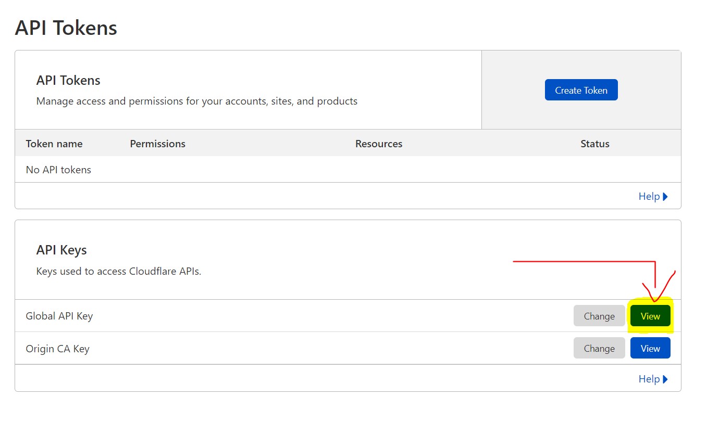

# Server-Proxy

xray panel with multi-protocol multi-user support

# Features

- System Status Monitoring
- Support multi-user multi-protocol, web page visualization operation
- Supported protocols: vmess, vless, trojan, shadowsocks, dokodemo-door, socks, http
- Support for configuring more transport configurations
- Traffic statistics, limit traffic, limit expiration time
- Customizable xray configuration templates
- Support https access panel (bring your own domain name + ssl certificate)
- Support one-click SSL certificate application and automatic renewal
- For more advanced configuration items, please refer to the panel

# Install & Upgrade

```
bash <(curl -Ls https://raw.githubusercontent.com/adelrz/Server-Proxy/master/install.sh)
```

## Manual install & upgrade

1. First download the latest compressed package from https://github.com/adelrz/Server-Proxy/releases, generally choose the `amd64` architecture
2. Then upload the compressed package to the `/root/` directory of the server, and use the `root` user to log in to the server

> If your server cpu architecture is not `amd64`, replace `amd64` in the command with another architecture

```
cd /root/
rm x-ui/ /usr/local/x-ui/ /usr/bin/x-ui -rf
tar zxvf x-ui-linux-amd64.tar.gz
chmod +x x-ui/x-ui x-ui/bin/xray-linux-* x-ui/x-ui.sh
cp x-ui/x-ui.sh /usr/bin/x-ui
cp -f x-ui/x-ui.service /etc/systemd/system/
mv x-ui/ /usr/local/
systemctl daemon-reload
systemctl enable x-ui
systemctl restart x-ui
```

## Install using docker

> This docker tutorial and docker image are provided by [Chasing66](https://github.com/Chasing66)

1. install docker

```shell
curl -fsSL https://get.docker.com | sh
```

2. install x-ui

```shell
mkdir x-ui && cd x-ui
docker run -itd --network=host \
    -v $PWD/db/:/etc/x-ui/ \
    -v $PWD/cert/:/root/cert/ \
    --name x-ui --restart=unless-stopped \
    enwaiax/x-ui:latest
```

> Build your own image

```shell
docker build -t x-ui .
```

## SSL Certificate application

> This function and tutorial are provided by [FranzKafkaYu](https://github.com/FranzKafkaYu)

The script has a built-in SSL certificate application function. To use this script to apply for a certificate, the following conditions must be met:

- Know the Cloudflare registered email
- Know the Cloudflare Global API Key
- The domain name has been resolved to the current server through cloudflare

How to get the Cloudflare Global API Key:
    

When using, just enter `domain name`, `email`, `API KEY`, the diagram is as follows:

Precautions:

- The script uses DNS API for certificate request
- By default, Let'sEncrypt is used as the CA party
- The certificate installation directory is the /root/cert directory
- The certificates applied for by this script are all generic domain name certificates

## Tg Robot use (under development, temporarily unavailable)

> This function and tutorial are provided by [FranzKafkaYu](https://github.com/FranzKafkaYu)

X-UI supports daily traffic notification, panel login reminder and other functions through Tg robot. To use Tg robot, you need to apply by yourself
For specific application tutorials, please refer to [blog link](https://coderfan.net/how-to-use-telegram-bot-to-alarm-you-when-someone-login-into-your-vps.html)
Instructions for use: Set robot-related parameters in the background of the panel, including

- Tg Robot Token
- Tg Robot ChatId
- Tg robot cycle runtime, in crontab syntax

Reference syntax:
- 30 * * * * * //Notification will be made at the 30s of each point
- @hourly      //hourly notification
- @daily       //Daily notification (0:00 AM)
- @every 8h    //Notification every 8 hours

TG Notification content:
- Node traffic usage
- Panel login reminder
- Node expiration reminder
- Traffic warning reminder

More features are planned...
## suggestion system

- CentOS 7+
- Ubuntu 16+
- Debian 8+

# common problem

## from v2-ui migrate

Installed first v2-ui Install the latest version on the server x-ui，Then use the following command to migrate, the native will be migrated v2-ui `All inbound account data` to x-ui, `Panel settings and username and password will not be migrated`

> After the migration is successful, please `close v2-ui` and `restart x-ui`, otherwise the inbound of v2-ui and the inbound of x-ui will cause a `port conflict`

```
x-ui v2-ui
```

## issue closure

All kinds of small white problems see high blood pressure

## Stargazers over time

[](https://starchart.cc/vaxilu/x-ui)
